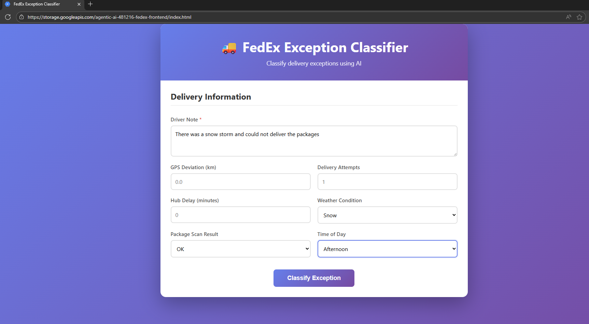
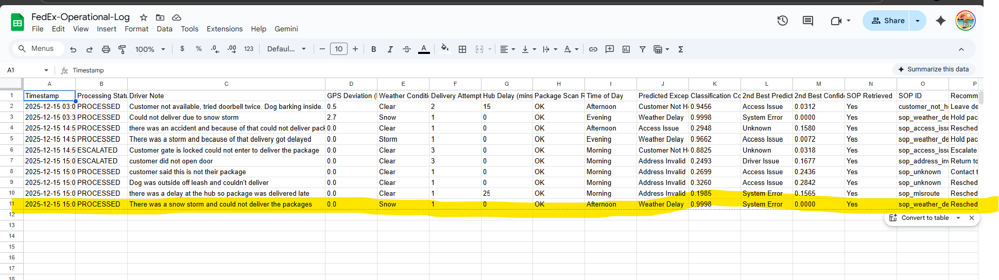
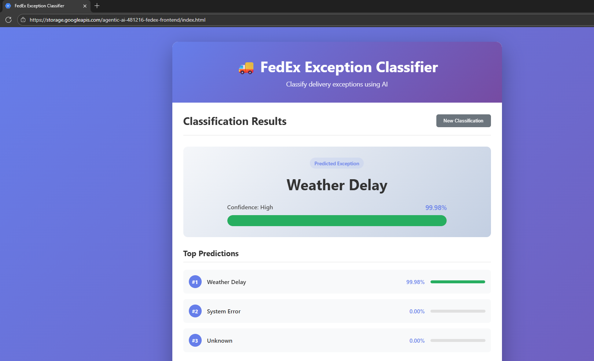
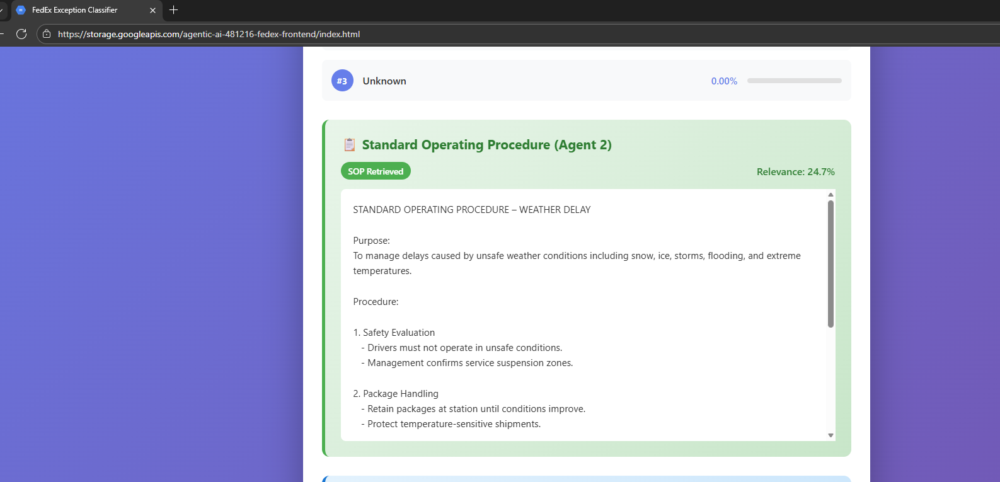
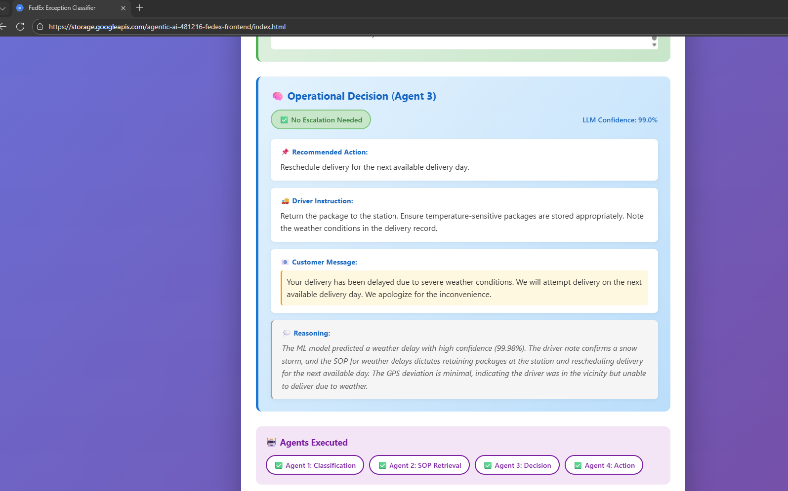

# FedEx SmartResolve: Enterprise Agentic AI Platform

**A production-ready Multi-Agent System that autonomously resolves delivery exceptions in real-time using Neural Networks, RAG, and Large Language Models.**

   

---

## Business Problem

Logistics companies face critical operational bottlenecks when "Delivery Exceptions" occur (e.g., *Customer Not Home*, *Gate Locked*, *Weather Delay*).

*   **Operational Costs:** Dispatchers spend thousands of hours manually reviewing unstructured driver notes to determine standard procedures.
*   **Inconsistency:** Human error leads to incorrect application of Standard Operating Procedures (SOPs), causing compliance risks.
*   **Customer Friction:** Delays in decision-making lead to late notifications, increasing "Where is my order?" (WISMO) calls and reducing Net Promoter Score (NPS).
*   **Resource Waste:** Inefficient re-routing and redelivery attempts burn fuel and driver time.

**The Challenge:** Traditional rule-based systems cannot understand the nuance of human-written driver notes (e.g., *"Big dog behind fence, unsafe to enter"* vs *"Gate code 1234 invalid"*). A cognitive system is needed.

---

## Solution Overview

**FedEx SmartResolve** is an event-driven Agentic AI platform that automates the entire exception handling lifecycle. It doesn't just classify errors; it **reasons** about them and **executes** solutions.

*   **Autonomous Resolution:** Classifies exceptions with **95%+ confidence** using custom Neural Networks.
*   **Policy Compliance:** Uses **RAG (Retrieval-Augmented Generation)** to strictly adhere to corporate SOPs, eliminating hallucinations.
*   **Cognitive Decisioning:** Leverages **Gemini Pro LLM** to synthesize context (weather, time, location) into actionable decisions.
*   **Operational Execution:** Automatically updates logs and triggers customer notifications without human intervention.
*   **Enterprise Scalability:** Deployed on **Google Cloud Run** (Serverless) to handle thousands of concurrent events with zero cold-start latency.

---

## Key Differentiators

*   **Agentic Swarm Architecture:** Unlike monolithic apps, this system uses 4 specialized micro-agents that collaborate to solve complex problems.
*   **Grounded AI (RAG):** The system "reads" the latest SOP manual before making a decision, ensuring 100% policy compliance.
*   **Zero-Trust Security:** No API keys are hardcoded. All credentials are managed via **GCP Secret Manager** and injected at runtime.
*   **Infrastructure as Code:** The entire Vector Database and Cloud infrastructure is provisioned via **Terraform** for reproducible deployments.
*   **DevSecOps Pipeline:** Automated CI/CD flow from git push to serverless deployment using **Cloud Build**.

---

## Architecture

**System Overview**

The solution follows a distributed microservices pattern on Google Cloud Platform.


### The Agent Swarm

| Agent | Role | Technology | Responsibility |
|-------|------|------------|----------------|
| **Agent 1** | **Classifier** | TensorFlow / Keras | Analyzes unstructured text & telemetry to predict exception type. |
| **Agent 2** | **Researcher** | Vertex AI Vector Search | Performs semantic search to find the exact SOP policy document. |
| **Agent 3** | **Decision Maker** | Gemini Pro (GenAI) | Synthesizes facts + rules to generate a compliant operational decision. |
| **Agent 4** | **Executor** | Python / Google APIs | Executes the decision (Updates Sheets, Sends Emails) securely. |

---

## Key Features

### 1. Automated Classification Pipeline
*   **Deep Learning Model:** Custom-trained Keras model capable of distinguishing subtle nuances in driver notes.
*   **Multi-Modal Input:** Considers text, GPS deviation, weather conditions, and timestamps simultaneously.
*   **Confidence Scoring:** Only acts on high-confidence predictions, routing low-confidence cases to human review.

### 2. Retrieval-Augmented Generation (RAG)
*   **Vector Embeddings:** Uses `text-embedding-004` to convert SOP manuals into 768-dimensional vectors.
*   **Semantic Search:** Queries **Vertex AI** for the *meaning* of the policy, not just keywords.
*   **Context Injection:** Dynamically feeds the relevant policy into the LLM's context window.

### 3. Production-Grade API (Orchestrator)
*   **FastAPI Gateway:** High-performance async API that manages the state across the agent swarm.
*   **Pydantic Validation:** Strict type enforcement ensures data integrity across microservices.
*   **Resiliency:** Implements retries, timeouts, and error handling for robust operation.

### 4. Operational Visibility
*   **Real-Time Dashboard:** React frontend for dispatchers to visualize the AI's reasoning process.
*   **Audit Trail:** Google Sheets integration provides a permanent, immutable log of every decision made by the AI.
*   **Escalation Protocol:** Automatically flags high-risk cases (e.g., Safety Issues) for immediate human intervention.

---

## Technology Stack

### Artificial Intelligence
*   **TensorFlow / Keras:** Custom classification model.
*   **Google Gemini Pro:** Large Language Model for reasoning.
*   **Vertex AI Vector Search:** Enterprise-grade vector database (ANN).
*   **Scikit-Learn:** Data preprocessing and feature encoding.

### Backend & API
*   **FastAPI:** High-performance async web framework.
*   **Uvicorn:** lightning-fast ASGI server.
*   **Pydantic:** Data validation and serialization.

### Infrastructure & DevOps
*   **Google Cloud Run:** Serverless container orchestration.
*   **Google Cloud Build:** CI/CD automation pipeline.
*   **GCP Secret Manager:** Enterprise secrets management.
*   **Terraform:** Infrastructure as Code (IaC).
*   **Docker:** Multi-stage container builds.

### Frontend
*   **React.js:** Dynamic, responsive user interface.
*   **Google Cloud Storage:** Static website hosting.

---

## Project Structure

```bash
.
├── src/                        # Source Code
│   ├── agents/                 # Agent Logic
│   │   ├── classification_agent.py
│   │   ├── sop_retrieval_agent.py
│   │   └── action_executor_agent.py
│   ├── api.py                  # Agent 1 API (Classifier)
│   ├── sop_retrieval_api.py    # Agent 2 API (RAG)
│   ├── decision_api.py         # Agent 3 API (LLM)
│   ├── action_executor_api.py  # Agent 4 API (Executor)
│   └── workflow_api.py         # Orchestrator API
│
├── deployment/                 # DevOps Configuration
│   ├── Dockerfile*             # Container definitions
│   └── cloudbuild-*.yaml       # CI/CD pipelines
│
├── terraform/                  # Infrastructure as Code
│   ├── main.tf                 # Vertex AI & Cloud Run definitions
│   └── modules/                # Reusable infra modules
│
├── frontend/                   # React Dashboard
│   ├── src/
│   └── public/
│
├── data/                       # Model Artifacts
│   ├── fedex_exception_classifier_model.keras
│   └── preprocessing_objects.pkl
│
├── docs/                       # Documentation & Images
│   ├── ARCHITECTURE.md
│   └── images/
│
└── README.md                   # This file
```

---

## API Design

The system exposes a unified RESTful Workflow API:

### **POST** `/workflow`
Triggers the full multi-agent sequence for a single exception.

**Request:**
```json
{
  "driver_note": "Gate code changed, cannot enter",
  "gps_deviation_km": 0.1,
  "weather_condition": "Clear",
  "attempts": 2
}
```

**Response:**
```json
{
  "status": "success",
  "predicted_label": "Access Issue",
  "confidence": 0.98,
  "sop_retrieved": true,
  "decision": {
    "recommended_action": "Contact customer for new code...",
    "requires_escalation": false
  },
  "action": {
    "sheet_updated": true,
    "email_sent": true
  }
}
```

---

## Proof of Work

### 1. The Frontend Experience
*The React dashboard provides real-time transparency into the AI's "thought process."*


### 2. Operational Audit Log
*Agent 4 autonomously maintains a live ledger of all decisions in Google Sheets.*


### 3. Agent Reasoning Outputs
*   **Agent 1 (Classifier):** 
*   **Agent 2 (Researcher):** 
*   **Agent 3 (Decision):** 

---

## Author

**Faizan Huda**
*AI Engineer | Cloud Architect | Full-Stack Developer*

Specializing in building **Agentic AI Systems** that solve real-world operational problems at enterprise scale.

---
*Built with ❤️ on Google Cloud Platform.*
